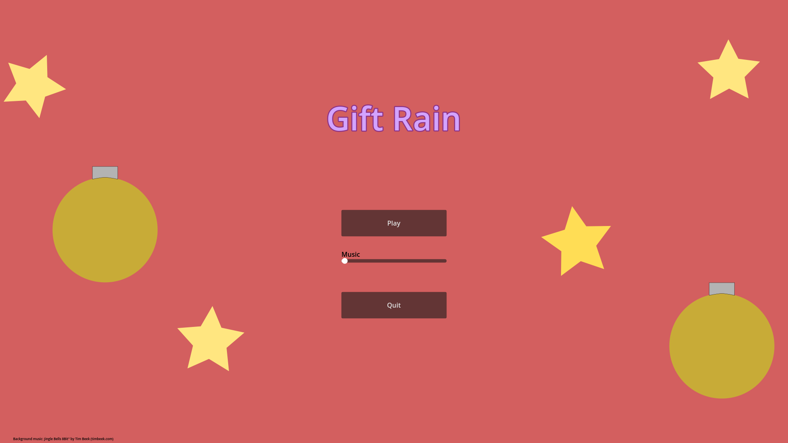
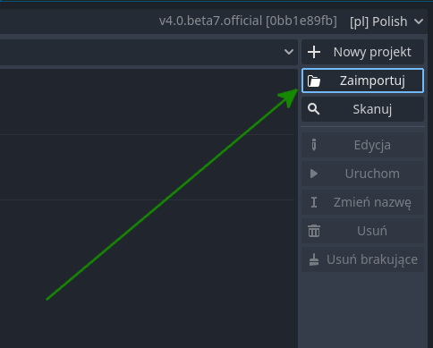
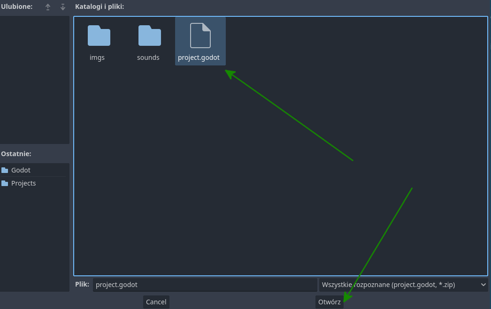
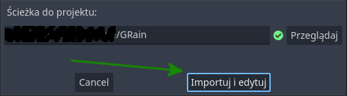
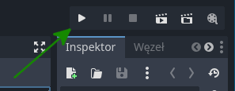

# Gift Rain
Prosta gra napisana przy użyciu silnika Godot4. Sterowanie Myszka  
Basic game written in Godot4 game engine. To play use your mouse

Your goal is to collect falling gifts, and try to avoid heavy coal.
## Instruction (Play)
To play this game go to [Releases](https://github.com/lukradecki/GRain/releases) and choose your platform.
## Instruction (Open in editor)
To start you need Godot4 beta 7 or newer ([Godot4 beta 8 download](https://downloads.tuxfamily.org/godotengine/4.0/beta8/))   

Next clone this repo `git clone https://github.com/lukradecki/GRain.git` and open it in the editor.  
First open the editor and click Import.  
    
Next go to the directory where you cloned the project and choose `project.godot` and click Open.  
  
After that you only need to Import and Edit the project.  
  
When you want to play just click Play button above Inspector.  

## Disclaimer
This was first ever game I crated using this engine. My main goal was to make something small and easy giving me opportunity to experiment with some of the concepts in game dev.
All the assets were created by me, with the exception to main menu music which is Jingle Bells 8Bit" by Tim Beek (timbeek.com), author gives permission to use his work, with requirement of owner recognition.
